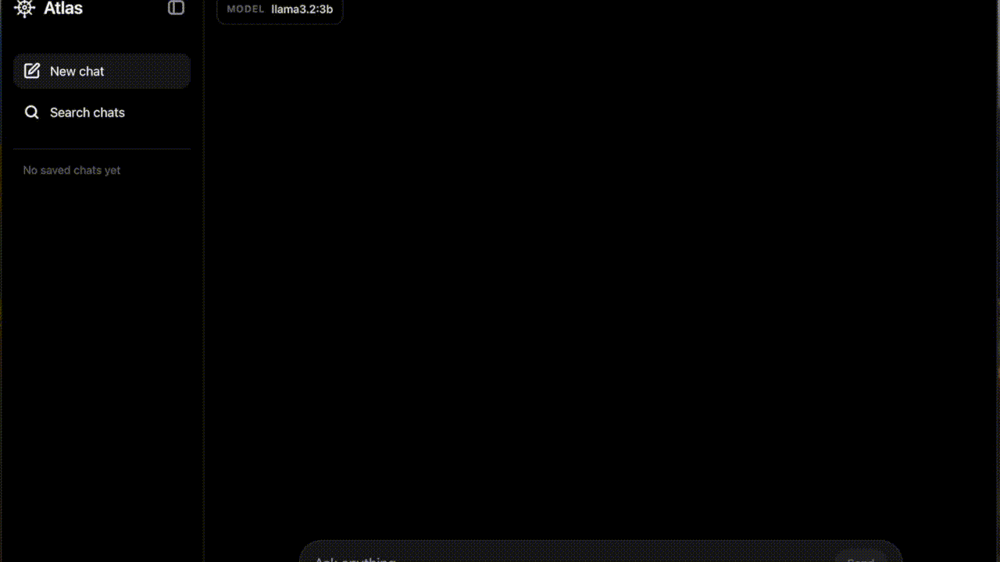

# Atlas

Local-first desktop AI workspace powered by Tauri, Rust, SQLite, React, and Ollama.

Atlas is a privacy-preserving desktop AI workspace for local model chat, local
history, model lifecycle management, diagnostics, search, local knowledge,
memory controls, jobs, benchmarking, and permissioned local tools. It is built
to keep user data on the device and route privileged work through a Rust/Tauri
backend instead of a hosted service.

## Demo

<p align="center">
  
</p>

## Highlights

- Local Ollama-powered chat with SQLite-backed conversation history.
- Search across saved chats and message content with SQLite FTS-backed results.
- Model selection, download, deletion, readiness checks, and local benchmark history.
- Cancellable generation, safe chat switching, first-run states, and error-state UX.
- Per-message model diagnostics with timing, token, context, memory, and source traces.
- Command palette, chat export, Diagnostics Center, and persistent job visibility.
- Transparent memory controls and conversation summaries that users can enable per chat.
- Local Knowledge Workspace MVP for approved text/code files.
- Permissioned local tool calls for read-limited Atlas tools.

## Features

### Local Chat

- Create, search, and delete conversations.
- Persist chats, messages, generation runs, summaries, memories, document source
  snapshots, context diagnostics, jobs, and tool-call records in local SQLite.
- Export conversations as Markdown, JSON, or plain text.
- Cancel in-progress generations and preserve safe pending-response behavior when
  switching chats.

### Local Models

- Connects to Ollama on `127.0.0.1:11434`.
- Lists installed models and surfaces local readiness state.
- Downloads and deletes Ollama models through the desktop UI.
- Records model generation metrics such as time to first token, token counts,
  duration, and tokens per second when Ollama returns them.
- Includes a Model Lab MVP for fixed-suite local model benchmarking.

### Knowledge, Memory, And Context

- Indexes approved local text/code files in a Knowledge Workspace MVP.
- Supports `.md`, `.txt`, `.json`, `.rs`, `.ts`, `.tsx`, `.js`, `.jsx`, `.py`,
  `.toml`, `.yaml`, and `.yml` files.
- Uses SQLite FTS for chat/message search and local knowledge search.
- Lets users create, edit, archive, restore, forget, pin, and source-link memory.
- Lets users enable or disable memory and knowledge context per chat.
- Shows prompt diagnostics for summaries, memories, prior messages, retrieved
  document chunks, model options, and truncation notices.

### Diagnostics And Tools

- Diagnostics Center shows app version, Ollama state, job state, SQLite health,
  indexed knowledge counts, model speed history, and recent backend errors.
- Persistent jobs model long-running work such as model downloads, knowledge
  indexing, benchmarks, and summary generation.
- Permissioned local tool calls support the read-limited tools
  `search_index`, `read_file_chunk`, and `get_model_stats`.

## Architecture

Atlas uses a Rust/Tauri backend for privileged operations, SQLite for local
persistence, Ollama for local model inference, and a React/Vite frontend for the
desktop UI. Long-running operations are modeled as jobs, and newer backend
commands are organized around service-layer boundaries rather than UI-owned
business logic.

The frontend lives primarily in `atlas-ai/src/App.tsx`, with typed Tauri command
wrappers in `atlas-ai/src/shared/api/tauri.ts`. The backend entry point is
`atlas-ai/src-tauri/src/lib.rs`; newer backend slices are split across `domain`,
`app`, and `infra` modules for models, jobs, search, diagnostics, benchmarks,
summaries, memories, knowledge, context assembly, and tools.

See `atlas-ai/docs/architecture.md` for the current architecture notes.

## Tech Stack

- Tauri 2
- Rust
- React
- Vite
- Tailwind CSS
- SQLite with WAL mode and FTS tables
- Ollama local HTTP API

## Getting Started

Requirements:

- Node.js and npm.
- Rust with Cargo.
- Tauri desktop prerequisites for the target operating system.
- Ollama running locally on `127.0.0.1:11434`.

Enter the app directory:

```bash
cd atlas-ai
```

Install dependencies:

```bash
npm install
```

Run the Vite frontend:

```bash
npm run dev
```

Run the Tauri desktop app:

```bash
npm run tauri:dev
```

Build the desktop app:

```bash
npm run tauri:build
```

## Useful Commands

Run these from `atlas-ai/`:

```bash
npm run lint
npm run build
cargo fmt --manifest-path src-tauri/Cargo.toml
cargo check --manifest-path src-tauri/Cargo.toml
cargo test --manifest-path src-tauri/Cargo.toml
cargo clippy --manifest-path src-tauri/Cargo.toml --all-targets -- -D warnings
```

## Privacy Model

Atlas is designed around local-first defaults. Conversations, indexed knowledge,
memories, job records, diagnostics metadata, benchmark history, and tool-call
audit records are stored in the local Tauri app data directory. Local model
requests are sent to the user's Ollama server at `127.0.0.1:11434`.

Atlas does not include cloud sync, hosted model providers, mobile support, or a
plugin marketplace in v1.1.0. Permissioned tool calls are restricted to
read-limited Atlas tools and require a user decision before execution.

## v1.1.0 Release Notes

Version `1.1.0` upgrades Atlas from a local chat app into a broader local AI
workspace. The release adds persistent jobs, Diagnostics Center, Model Lab,
SQLite-backed FTS search improvements, chat export, command palette,
conversation summaries, transparent memory controls, local knowledge indexing,
context diagnostics, and permissioned local tool-call surfaces.

See `atlas-ai/CHANGELOG.md` for the release log.

## Roadmap

Planned next: frontend token streaming, embeddings-backed retrieval, hybrid
search, automatic re-indexing, PDF/DOCX ingestion, broader frontend
modularization, and a database migrations directory.
